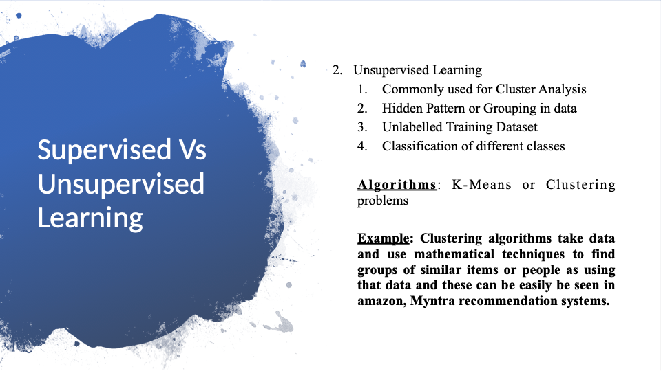

# Session : Machine Learning

***
 

## Index

***

 

## Difference Between AI, ML & Deep Learning

***

 

## Prediction, Classification & Clustering

* ### **Prediction**

* ### **Classification**

* ### **Clustering**

***

 

## Supervised & Unsupervised Learning

* ### **Supervised Learning**

* ### **Unsupervised Learning**

***

 

## Why Data Preprocessing is Important?

* ### **Missing Data**

* ### **Categorical Data**

* ### **Too Much Correlation Problem**

* ### **Parameter Domination Problem**

***

 

## How Data Preprocessing solved all mentioned problems

* ### **Imputer Library** (solves Missing Data Problem)

* ### **Giving Numerical Values to each Category Value** (Solves Categorical One)

* ### **Splitting the Dataset into Training & Testset** (Too Much Correlation Problem)

* ### **Feature Scaling** (Parameter Problem)

***

 

## Polynomial Regression Model

***

 

## Demo

***Data Pre-Processing Link***: [Data Pre-Processing](https://colab.research.google.com/drive/1MHl7yUrciz2H5bhJf3_Iq3hrI4cjKXYD?usp=sharing)

***Dataset for Data Pre-Processing***:  [Dataset](https://drive.google.com/file/d/1dLkgUJAV6EqcqZH1PNBaM2UOrB2qJuFP/view?usp=sharing)

***Polynomial Regression Model***:  [Polynomial_Model](https://colab.research.google.com/drive/1VnQiOQefafynDa_wUiA0jNl7TU4eBzFJ?usp=sharing)

***Dataset for Polynomial Regression***:    [Dataset](https://drive.google.com/file/d/1Oyv3xh4V-jAaucJwzDuarXNwDBy8JTkS/view?usp=sharing)

***

 

## Session Video LINK: [MACHINE LEARNING SESSION](https://drive.google.com/file/d/1xyvEN6VdlYRUrUqVrt-QB85ct9AYRcqQ/view?usp=sharing)
